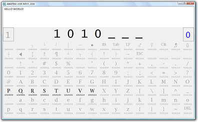

# ZER0-ONE

**The editor for programmers who think in binary.**

Inspired by a cafe discussion of how pinball machines work, ZeroOne (or 'ZO' to its
friends) is an editor where the only keys required are Zero and One.

If you press any other key, your document is wiped.

Using just Zero and One you can type the complete works of Shakespeare, if you had
enough free time.

The blog post describing/launching it is here: <https://secretGeek.net/zo_intro>

There is a video showing it in action at Vimeo: <https://vimeo.com/20149349>

-----

This was originally published at CodePlex, until Microsoft made it readonly, then
deleted their archives. Fortunately, here at github, it's beyond Microsoft's
clutches. Oh wait.
